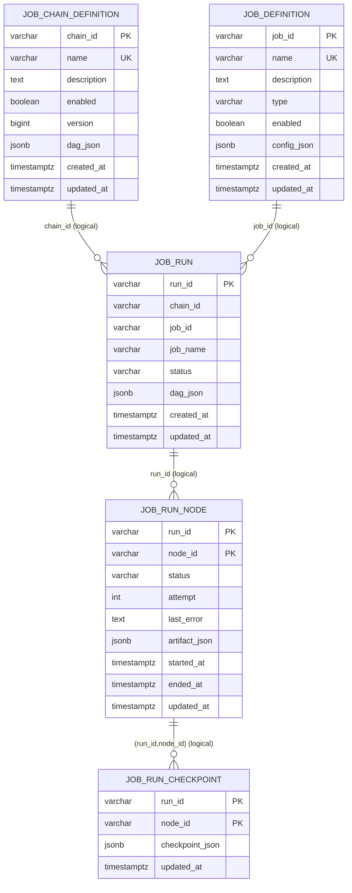

# JobChain DAG - 数据库表结构 & ER 图（v0.0）

> 本文档基于 `job-chain-dag/src/main/resources/schema.sql`（PostgreSQL）梳理。
> 
> 测试库（H2）对应的 schema 在：`job-chain-dag/src/test/resources/schema.sql`，字段一致，类型略有差异（jsonb/timestamptz -> clob/timestamp）。

---

## 0. ER 图（Mermaid，可渲染）

> 说明：当前 DDL 未显式创建外键（FK）。下面 Mermaid 图是“逻辑关系”表达，用于帮助理解。
>
> 如果你的 Markdown 渲染器不支持 Mermaid，可以直接看后面的“文本版 ER 图”。



---

## 1. 表清单（按域划分）

### 1.1 Definition（定义态）

- `job_definition`：可复用的节点任务定义（executor type + config_json）
- `job_chain_definition`：任务链定义（DAG 图，dag_json）

### 1.2 Runtime（运行态）

- `job_run`：一次运行（run）的总览。可关联 chain / job，并存 dag 快照
- `job_run_node`：一次 run 中，每个 node 的运行状态/产物
- `job_run_checkpoint`：一次 run 中，每个 node 的 checkpoint（断点）

---

## 2. 各表字段结构（字段名/类型/约束/索引）

> 类型以 PostgreSQL 为准；H2 测试库会用 `clob/timestamp` 代替 `jsonb/timestamptz`。

### 2.x 约束与索引清单（汇总）

> 本模块当前 schema 里大部分约束是：PK + name 唯一；运行态额外有 run 的辅助索引。
> 
> 注意：当前 DDL **没有显式外键（FK）**。

- `job_definition`
  - PK：`job_definition_pkey (job_id)`（逻辑等价）
  - UK：`job_definition_name_key (name)`（逻辑等价）

- `job_chain_definition`
  - PK：`job_chain_definition_pkey (chain_id)`（逻辑等价）
  - UK：`job_chain_definition_name_key (name)`（逻辑等价）

- `job_run`
  - PK：`job_run_pkey (run_id)`（逻辑等价）
  - INDEX：`idx_job_run_chain_id (chain_id)`
  - INDEX：`idx_job_run_job_id (job_id)`

- `job_run_node`
  - PK：`job_run_node_pkey (run_id, node_id)`（逻辑等价）

- `job_run_checkpoint`
  - PK：`job_run_checkpoint_pkey (run_id, node_id)`（逻辑等价）

> 说明：上面的约束名在不同数据库里可能会自动生成不同的名字（尤其是 PK/UK）。
> 本文档以“约束语义”来表达，方便跨库理解。

### 2.1 `job_definition`

用途：定义一个可被 DAG 节点引用的 Job（通过 `jobId`）。

| 字段 | 类型 | 约束 | 说明 |
|---|---|---|---|
| `job_id` | varchar(64) | PK | Job 主键 |
| `name` | varchar(128) | NOT NULL, UNIQUE | Job 名称（唯一） |
| `description` | text |  | 描述 |
| `type` | varchar(64) | NOT NULL | executor 类型（例如 print/shell 等） |
| `enabled` | boolean | NOT NULL, default true | 是否启用 |
| `config_json` | jsonb | NOT NULL, default '{}'::jsonb | executor 配置 |
| `created_at` | timestamptz | NOT NULL, default now() | 创建时间 |
| `updated_at` | timestamptz | NOT NULL, default now() | 更新时间 |

索引/约束：
- `PK(job_id)`
- `UNIQUE(name)`

### 2.2 `job_chain_definition`

用途：定义一条 chain（DAG 图），图里节点可以引用 `job_definition.job_id`。

| 字段 | 类型 | 约束 | 说明 |
|---|---|---|---|
| `chain_id` | varchar(64) | PK | Chain 主键 |
| `name` | varchar(128) | NOT NULL, UNIQUE | Chain 名称（唯一） |
| `description` | text |  | 描述 |
| `enabled` | boolean | NOT NULL, default true | 是否启用 |
| `version` | bigint | NOT NULL, default 1 | 乐观锁版本号 |
| `dag_json` | jsonb | NOT NULL | DAG 定义快照（节点含：id/jobId/dependsOn/retry...） |
| `created_at` | timestamptz | NOT NULL, default now() | 创建时间 |
| `updated_at` | timestamptz | NOT NULL, default now() | 更新时间 |

索引/约束：
- `PK(chain_id)`
- `UNIQUE(name)`

### 2.3 `job_run`

用途：一次运行（run）总览。

> 说明：该表当前没有显式外键（FK）约束，但逻辑上存在引用关系：
> - `chain_id` -> `job_chain_definition.chain_id`（可空）
> - `job_id` -> `job_definition.job_id`（可空）

| 字段 | 类型 | 约束 | 说明 |
|---|---|---|---|
| `run_id` | varchar(64) | PK | Run 主键 |
| `chain_id` | varchar(64) |  | 对应 chain（链路追踪）|
| `job_id` | varchar(64) |  | 对应 job（预留）|
| `job_name` | varchar(128) | NOT NULL | 名称展示字段（当前 run 创建时写入）|
| `status` | varchar(32) | NOT NULL | PENDING/RUNNING/SUCCESS/FAILED/STOPPING/STOPPED |
| `dag_json` | jsonb | NOT NULL | 本次 run 的 DAG 快照（用于回放/排障/接口 join） |
| `created_at` | timestamptz | NOT NULL, default now() | 创建时间 |
| `updated_at` | timestamptz | NOT NULL, default now() | 更新时间 |

索引：
- `PK(run_id)`
- `idx_job_run_chain_id(chain_id)`
- `idx_job_run_job_id(job_id)`

### 2.4 `job_run_node`

用途：记录 run 内每个 node 的运行状态与产物。

逻辑引用：
- `run_id` -> `job_run.run_id`

| 字段 | 类型 | 约束 | 说明 |
|---|---|---|---|
| `run_id` | varchar(64) | PK (part) | 所属 run |
| `node_id` | varchar(128) | PK (part) | 节点 id（来自 dag_json）|
| `status` | varchar(32) | NOT NULL | PENDING/RUNNING/SUCCESS/FAILED/RETRYING/SKIPPED/STOPPED |
| `attempt` | int | NOT NULL, default 0 | 尝试次数 |
| `last_error` | text |  | 最后一次错误 |
| `artifact_json` | jsonb |  | 节点产物（可空） |
| `started_at` | timestamptz |  | 开始时间 |
| `ended_at` | timestamptz |  | 结束时间 |
| `updated_at` | timestamptz | NOT NULL, default now() | 更新时间 |

索引/约束：
- `PK(run_id, node_id)`

### 2.5 `job_run_checkpoint`

用途：记录节点 checkpoint（用于重试/恢复）。

逻辑引用：
- `(run_id, node_id)` -> `job_run_node(run_id, node_id)`（当前未做 FK，但语义如此）

| 字段 | 类型 | 约束 | 说明 |
|---|---|---|---|
| `run_id` | varchar(64) | PK (part) | 所属 run |
| `node_id` | varchar(128) | PK (part) | 节点 id |
| `checkpoint_json` | jsonb | NOT NULL | checkpoint 内容 |
| `updated_at` | timestamptz | NOT NULL, default now() | 更新时间 |

索引/约束：
- `PK(run_id, node_id)`

---

## 3. ER 图（文本版）

> 说明：当前 DDL 未显式创建外键（FK）。下面的连线采用“逻辑外键”的方式描述。

```
+---------------------+            +--------------------------+
|   job_definition    |            |    job_chain_definition  |
|---------------------|            |--------------------------|
| PK job_id           |            | PK chain_id              |
| UK name             |            | UK name                  |
| type                |            | enabled                  |
| enabled             |            | version                  |
| config_json (jsonb) |            | dag_json (jsonb)         |
| created_at          |            | created_at               |
| updated_at          |            | updated_at               |
+----------+----------+            +------------+-------------+
           ^                                     ^
           | (logical FK)                        | (logical FK)
           | job_run.job_id                      | job_run.chain_id
           |                                     |
+----------+-------------------------------------+------------------+
|                              job_run                             |
|------------------------------------------------------------------|
| PK run_id                                                         |
| chain_id (nullable)                                               |
| job_id (nullable)                                                 |
| job_name                                                          |
| status                                                            |
| dag_json (jsonb)                                                  |
| created_at                                                        |
| updated_at                                                        |
+-------------------------------+----------------------------------+
                                |
                                | (logical FK) job_run_node.run_id
                                v
                   +-------------------------------+
                   |         job_run_node          |
                   |-------------------------------|
                   | PK (run_id, node_id)          |
                   | status                         |
                   | attempt                        |
                   | last_error                     |
                   | artifact_json (jsonb)          |
                   | started_at                     |
                   | ended_at                       |
                   | updated_at                     |
                   +---------------+---------------+
                                   |
                                   | (logical FK) (run_id,node_id)
                                   v
                   +-------------------------------+
                   |      job_run_checkpoint       |
                   |-------------------------------|
                   | PK (run_id, node_id)          |
                   | checkpoint_json (jsonb)        |
                   | updated_at                     |
                   +-------------------------------+
```

---

## 4. 约束/关系补充说明（为什么没 FK）

当前 DDL 没有创建显式 FK 的好处是：
- 更容易跨库/跨环境（H2/PG）跑通，减少方言与约束差异
- run/节点写入可以更“松耦合”，避免外键导致的写入阻塞

风险与治理方式：
- 需要在业务层保证一致性（例如：创建 run 后必须初始化 node；删除 job 时需考虑 chain 引用）
- 建议后续增加“引用检查”接口或后台巡检

---

## 5. 建议的未来增强（可选）

1) 增加显式 FK（可选开关）：
- `job_run.chain_id` -> `job_chain_definition.chain_id`
- `job_run.job_id` -> `job_definition.job_id`
- `job_run_node.run_id` -> `job_run.run_id`
- `job_run_checkpoint(run_id,node_id)` -> `job_run_node(run_id,node_id)`

2) 增加索引：
- `job_run(status, updated_at)`（便于 run 列表/监控）
- `job_run_node(run_id, status)`（便于监控失败节点）

3) 对 DAG 节点 jobId 的引用关系做落库（可选中间表）：
- `job_chain_node_ref(chain_id, node_id, job_id)`

这样可以用 SQL 直接 join 出“链定义 -> 节点 -> job detail”，减少 JSON 解析成本。
